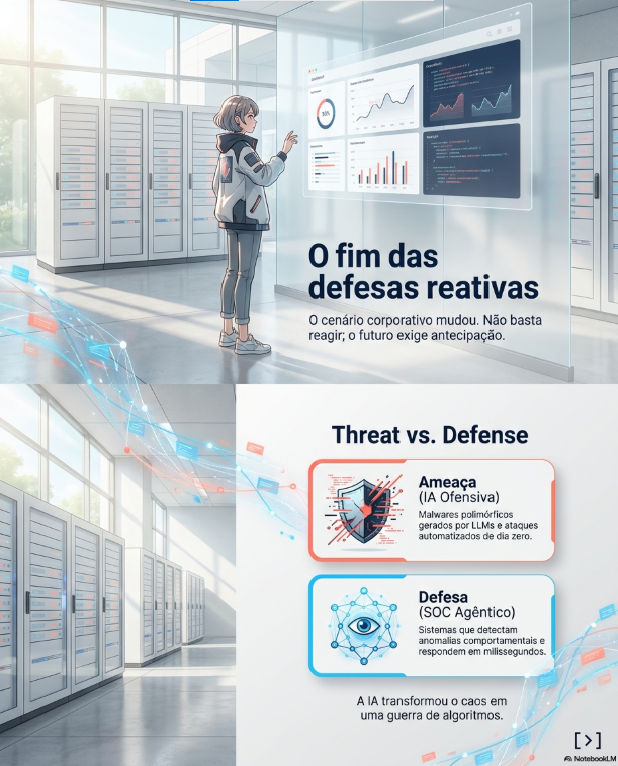
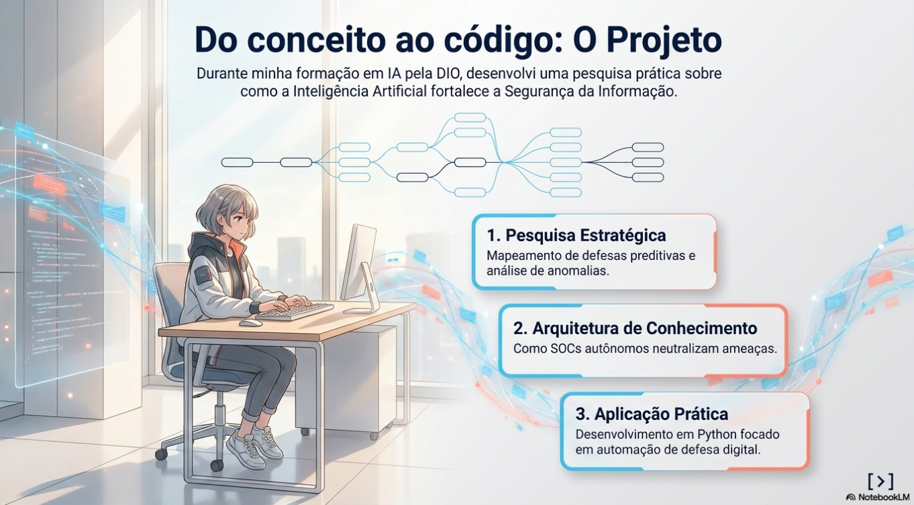
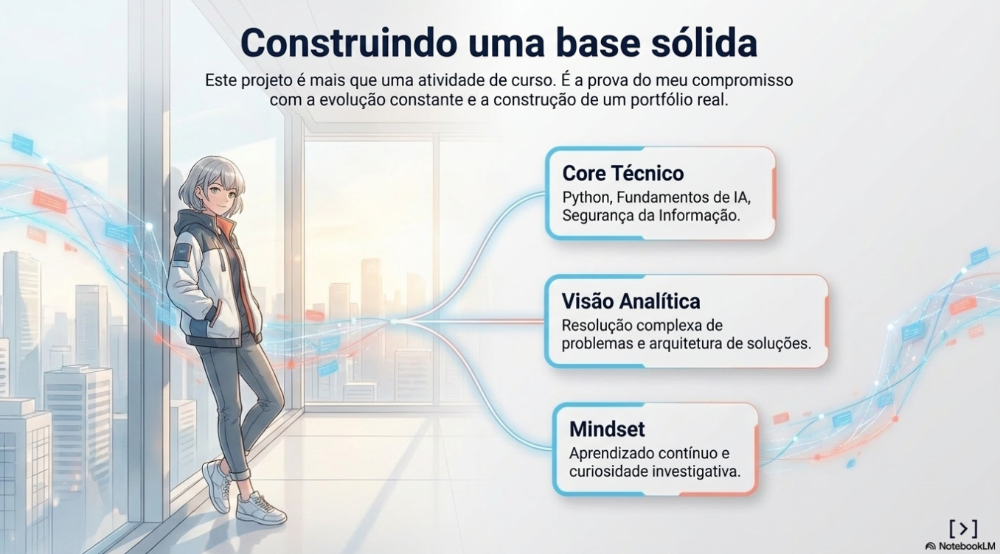

# IA na Cibersegurança

## Caderno Temático desenvolvido com NotebookLM

---

## Sobre o Projeto

Este projeto foi desenvolvido como parte do desafio da DIO com o objetivo de estudar a aplicação da Inteligência Artificial na Cibersegurança utilizando o NotebookLM como ferramenta de aprendizagem ativa.

Durante o desenvolvimento do projeto foram analisadas documentações oficiais, artigos científicos, estudos técnicos e conteúdos produzidos por empresas líderes em Segurança da Informação.

O objetivo foi compreender como a Inteligência Artificial está transformando a defesa cibernética, a automação de operações de segurança (SOC), a análise de ameaças e os desafios relacionados ao uso seguro dessa tecnologia.

---

## Objetivos

- Estudar como a Inteligência Artificial é aplicada à Cibersegurança.
- Desenvolver habilidades de pesquisa utilizando o NotebookLM.
- Aprimorar técnicas de Engenharia de Prompts.
- Consolidar conhecimentos por meio de um Miniguia de Estudos.
- Criar um projeto de documentação técnica para compor meu portfólio no GitHub e Linkedin.

---

## Curadoria de Fontes

Durante este projeto foram utilizadas mais de **30 fontes** entre documentações oficiais, artigos científicos, empresas especializadas em segurança, estudos de mercado e conteúdos técnicos.

## Organizações

- NIST
- OWASP Foundation
- ISO 42001

## Cloud Computing

- Google Cloud
- Microsoft Security

## Empresas Especializadas

- Cisco
- CrowdStrike
- Darktrace
- Palo Alto Networks
- Fortinet
- IBM
- Trend Micro
- CybelAngel
- Seceon

## Artigos Científicos

- Enhancing Cybersecurity with Explainable AI
- The Infinite Mutation Engine
- dias2014,+Artigo02RevisadoEditado.pdf

## Tendências

- BusinessDay
- Security Boulevard
- TechDogs

---

### Fontes de Referência: IA na Cibersegurança (2026)

| Nome da Fonte | Autor ou Organização | Tipo de Material | Link Original |
| :--- | :--- | :--- | :--- |
| **AI Infrastructure, Secure Networking, and Software Solutions** | Cisco | Documentação | [Acessar](https://www.cisco.com/site/us/en/index.html) |
| **AI and Cloud Computing Services** | Google Cloud | Documentação | [Acessar](https://cloud.google.com/) |
| **AI for Cybersecurity** | Secure Elements UK | Webpage | [Acessar](https://secureelements.co.uk/ai-for-cybersecurity) |
| **Adversaries Leverage AI for Vulnerability Exploitation** | Google Cloud Blog | Blog | [Acessar](https://cloud.google.com/blog/topics/threat-intelligence/ai-vulnerability-exploitation-initial-access) |
| **Artificial Intelligence trends to watch in 2026** | Businessday NG | Artigo | [Acessar](https://businessday.ng/technology/article/artificial-intelligence-trends-to-watch-in-2026/) |

---

# Índice

- Sobre o Projeto
- Objetivos
- Curadoria de Fontes
- Engenharia de Prompts
- Cicatrizes
- Miniguia de Estudos
- Glossário
- Prompts Reutilizáveis
- Aplicação Profissional
- Conclusão

---

# Engenharia de Prompts

Durante o desenvolvimento deste projeto, utilizei diferentes estratégias de prompts para explorar as fontes carregadas no NotebookLM. Cada prompt tinha um objetivo específico, permitindo aprofundar o estudo, comparar informações e organizar o conhecimento.

## Prompt 1

**Pergunta**

> Explique como a Inteligência Artificial é utilizada na Cibersegurança utilizando apenas as fontes presentes neste NotebookLM.

**Objetivo**

Compreender como a IA é utilizada na área de Segurança da Informação utilizando exclusivamente as referências estudadas.

**Resposta**

A Inteligência Artificial (IA) em cibersegurança é compreendida como um vasto ecossistema de tecnologias, incluindo Aprendizado de Máquina (ML), Aprendizado Profundo (Deep Learning) e IA Generativa (GenAI), voltadas para a detecção, prevenção e resposta a ameaças digitais em velocidade de máquina

Abaixo, detalha-se como essa tecnologia é utilizada, conforme as fontes:

## Introdução

- A IA atua como um sistema computacional que emula processos cognitivos humanos e toma decisões baseadas em padrões de dados, sem ser diretamente programada para cada tarefa. Em 2026, ela consolidou-se como a espinha dorsal da resiliência operacional corporativa, permitindo que as organizações enfrentem um cenário onde os ataques evoluem mais rápido do que a capacidade de reação humana

## Principais Aplicações

- SOC Agêntico (Agentic SOC): Implementação de agentes autônomos que planejam e executam fluxos de investigação de incidentes de ponta a ponta, realizando triagens e mitigações sob supervisão humana mínima

- Análise Comportamental (Pattern of Life): Uso de algoritmos para aprender o comportamento normal de usuários, redes e dispositivos, permitindo a identificação imediata de anomalias que indicam ameaças internas ou ataques de dia zero

- Gestão Preditiva de Vulnerabilidades: Utilização de modelos como o EPSS (Exploit Prediction Scoring System) para prever matematicamente a probabilidade de uma vulnerabilidade ser explorada nos próximos 30 dias

- Detecção de Phishing e Malware: Algoritmos de Deep Learning analisam o conteúdo, contexto e metadados de e-mails e arquivos para bloquear golpes sofisticados e malwares polimórficos que evadem assinaturas tradicionais

- Resposta Autônoma: Sistemas que tomam decisões cirúrgicas em tempo real, como isolar hosts infectados ou restringir acessos não autorizados, neutralizando ataques em segundos

## Benefícios

- Velocidade e Escala: Capacidade de analisar trilhões de sinais diários e responder a incidentes em milissegundos, reduzindo janelas de exposição de horas para frações de segundo

- Redução de Ruído: Filtragem inteligente de alertas que elimina falsos positivos em até 99,9%, combatendo a fadiga dos analistas e permitindo foco em ameaças críticas

- Eficiência Financeira: Organizações que adotam IA extensivamente registram uma economia média de 1,9 milhão de dólares por incidente de violação de dados

- Aprendizado Contínuo: As defesas tornam-se mais resilientes ao aprenderem com cada nova ameaça interceptada, ajustando-se automaticamente ao cenário mutável

## Limitações

- O Paradoxo da Caixa Preta: Muitos modelos operam de forma opaca, dificultando a compreensão do raciocínio lógico por trás de um veredito, o que pode gerar desconfiança em analistas humanos

- Dependência de Dados de Qualidade: A eficácia da IA é proporcional à qualidade da telemetria; dados sujos, incorretos ou enviesados levam a decisões falhas e "alucinações"

- Riscos de IA Adversária: Atacantes podem subverter a IA através do envenenamento de dados (data poisoning) no treinamento para criar backdoors, ou por ataques de evasão que enganam o classificador

- Uso Ofensivo Industrializado: Criminosos utilizam as mesmas ferramentas de IA para automatizar a criação de malware polimórfico e gerar deepfakes convincentes para engenharia social

## Tendências

- Plataformização: Consolidação de ferramentas isoladas em ecossistemas unificados para eliminar lacunas de visibilidade e reduzir custos de integração.

- AI TRiSM (Trust, Risk, and Security Management): Adoção de frameworks focados na governança, transparência e explicabilidade da IA para garantir confiança e conformidade.

- Conformidade Regulatória: Implementação de normas como a ISO/IEC 42001 e conformidade com o EU AI Act, tornando a segurança e ética da IA requisitos auditáveis.

- IA Soberana: Aumento no uso de modelos de IA locais para garantir que dados sensíveis não sejam expostos a nuvens públicas de terceiros

## Conclusão

- A Inteligência Artificial em cibersegurança é uma "faca de dois gumes" que redefiniu o equilíbrio entre ataque e defesa.
- Embora potencialize ataques altamente sofisticados, ela é a única via para uma defesa proativa capaz de operar em velocidade de máquina.
- O sucesso estratégico reside na manutenção do "humano no loop" (human-in-the-loop), onde a supervisão crítica humana valida e governa as decisões probabilísticas dos sistemas autônomos.

---

# Miniguia de Estudos

Este miniguia apresenta um panorama detalhado da interseção entre a Inteligência Artificial (IA) e a Cibersegurança em 2026, fundamentado exclusivamente nas fontes analisadas.

##Introdução

- A Inteligência Artificial transformou-se na espinha dorsal da resiliência operacional das organizações, deixando de ser uma ferramenta auxiliar para se tornar o motor principal da defesa digital. Em um cenário onde as ameaças se movem em "velocidade de máquina", a IA permite que os defensores analisem volumes massivos de telemetria que seriam impossíveis de processar manualmente. Entretanto, a tecnologia é descrita como uma "faca de dois gumes", pois as mesmas capacidades que fortalecem a defesa são utilizadas por criminosos para industrializar ataques sofisticados

## Conceitos Fundamentais

- Inteligência Artificial (IA): Sistemas que emulam processos cognitivos humanos, como aprendizado e resolução de problemas, para tomar decisões sem programação direta para cada tarefa específica

- Machine Learning (ML): Subconjunto da IA focado em algoritmos que detectam padrões em grandes massas de dados para realizar previsões ou classificações, como a detecção de fraudes

- Deep Learning (Aprendizado Profundo): Tecnologia avançada que utiliza redes neurais de múltiplas camadas para imitar os neurônios cerebrais, sendo altamente eficaz no reconhecimento de imagens e na detecção de phishing complexo

- IA Generativa (GenAI): Modelos capazes de criar novos conteúdos (texto, código, imagens) a partir de dados de treinamento, facilitando a automação de relatórios e a investigação via linguagem natural

- SOC Agêntico (Agentic SOC): Uma arquitetura de Centro de Operações de Segurança que utiliza agentes autônomos para planejar e executar investigações de incidentes de ponta a ponta

## Aplicações

- Análise de Padrão de Vida (Pattern of Life): A IA aprende o comportamento normal de usuários e dispositivos para identificar desvios anômalos que indicam invasões ou ameaças internas

- Gestão Preditiva de Vulnerabilidades: Uso de ciência de dados e modelos como o EPSS para prever matematicamente a probabilidade de uma falha de segurança ser atacada nos próximos 30 dias

- Detecção de Ameaças em Tempo Real: Identificação automática de malware polimórfico e ataques de "dia zero" através de análise comportamental, superando as limitações das assinaturas estáticas tradicionais

- Resposta Autônoma: Sistemas que tomam decisões imediatas, como isolar um computador infectado ou bloquear tráfego malicioso em milissegundos, sem intervenção humana

- Copilotos de Segurança: Assistentes que traduzem dados técnicos complexos para linguagem natural, auxiliando analistas na criação de consultas (como KQL) e na triagem de alertas

## Benefícios

Velocidade e Escala: Capacidade de processar trilhões de sinais diários e reagir a ameaças em frações de segundo

Redução de Ruído: Filtragem inteligente de alertas que elimina até 99,9% dos falsos positivos, combatendo a fadiga dos analistas e permitindo foco em incidentes críticos

Economia Financeira: Organizações que adotam IA de forma extensiva economizam, em média, 1,9 milhão de dólares por incidente de violação de dados

Postura Proativa: Transição de uma defesa reativa para uma estratégia capaz de antecipar ataques antes que eles causem danos reais

## Limitações

- O Paradoxo da Caixa Preta (Black Box): A opacidade de alguns modelos dificulta que humanos compreendam o raciocínio por trás de uma decisão, exigindo o avanço da IA Explicável (XAI)

- Dependência da Qualidade dos Dados: Se os dados de treinamento forem "sujos", enviesados ou incompletos, a IA gerará decisões falhas e as chamadas "alucinações"

- IA Adversária: Riscos de envenenamento de dados (data poisoning) para criar backdoors e ataques de evasão que enganam classificadores de segurança

- Necessidade de Humano no Loop: A tecnologia ainda é probabilística e requer supervisão humana estratégica para validar saídas e garantir conformidade ética

##Tendências

- Plataformização: Consolidação de ferramentas isoladas em ecossistemas unificados (como Palo Alto Cortex XSIAM e CrowdStrike Falcon) para fechar lacunas de visibilidade

- Soberania de Dados e IA Local: Aumento do uso de modelos de IA rodando localmente (on-premises) para evitar o envio de dados sensíveis para nuvens públicas

- Governança Estrita: Adoção de normas globais como a ISO/IEC 42001 e conformidade obrigatória com o EU AI Act e o NIST AI RMF

- Segurança Quântica: Implementação de algoritmos criptográficos resistentes à computação quântica dentro das plataformas de IA

## Conclusão

- Em 2026, o sucesso na cibersegurança não depende apenas da tecnologia, mas da integração estratégica entre a potência da IA e o julgamento crítico humano. Embora os atacantes estejam industrializando suas operações, as organizações que adotam frameworks de confiança como o AI TRiSM e mantêm uma governança rigorosa estão melhor posicionadas para transformar a complexidade tecnológica em vantagem competitiva. A IA na segurança é o novo normal; quem não a utiliza está, essencialmente, fora do jogo

---

# Glossário

Este glossário reúne os conceitos fundamentais da Inteligência Artificial aplicada à cibersegurança em 2026, explicados de forma simples para facilitar o entendimento de profissionais e iniciantes.

## A - C
  
- Agente de IA (AI Agent): Software inteligente capaz de planejar, agir e completar tarefas complexas por conta própria, sem precisar que um humano comande cada pequeno passo

- Alucinação: Fenômeno em que a IA gera informações falsas ou inventadas com total confiança, geralmente devido a falhas nos dados de treinamento

- Análise de Padrão de Vida (Pattern of Life): Técnica onde a IA aprende o comportamento normal de usuários e dispositivos em uma rede para identificar imediatamente qualquer desvio que pareça um ataque

- Aprendizado de Máquina (Machine Learning - ML): Algoritmos que "aprendem" sozinhos ao encontrar padrões em grandes quantidades de dados, permitindo fazer previsões futuras

- Aprendizado Profundo (Deep Learning - DL): Uma versão mais potente do aprendizado de máquina que tenta imitar o funcionamento dos neurônios do cérebro para resolver tarefas muito difíceis, como reconhecer rostos ou e-mails de phishing

- Ataque de Evasão (Evasion Attack): Técnica usada por criminosos que altera levemente um dado (como um vírus) para que a IA de segurança não o reconheça e o deixe passar como algo inofensivo

- Caixa Preta (Black Box): Termo usado para descrever sistemas de IA que tomam decisões corretas, mas cujos processos internos são tão complexos que nenhum humano consegue explicar exatamente como ela chegou naquele resultado.
  
## D - I

- Data Poisoning (Envenenamento de Dados): Quando um hacker injeta informações falsas ou corrompidas durante o treinamento de uma IA para "ensiná-la" a ignorar ataques reais no futuro

- Deepfake: Uso de IA para criar áudios, imagens ou vídeos falsos de pessoas reais, geralmente usado para enganar funcionários e realizar fraudes financeiras

- EPSS (Exploit Prediction Scoring System): Um modelo matemático que usa IA para prever qual a chance de uma falha de segurança ser atacada por hackers nos próximos 30 dias

- IA Explicável (Explainable AI - XAI): Conjunto de métodos que "traduz" o raciocínio complexo da IA em uma linguagem que o ser humano consiga entender e confiar

- IA Generativa (GenAI): Tecnologia capaz de criar novos conteúdos, como textos, relatórios, imagens e até códigos de programação, em vez de apenas analisar o que já existe

- IA TRiSM: Um conjunto de regras e ferramentas para garantir que o uso da IA em uma empresa seja confiável, seguro, justo e proteja a privacidade dos dados

- ISO 42001: O primeiro padrão internacional que ensina empresas a gerenciar sistemas de inteligência artificial de forma responsável e segura

## J - Z

- Janela de Contexto (Context Window): É a "memória de curto prazo" da IA durante uma conversa; quanto maior ela for, mais informações do passado o sistema consegue considerar para dar a próxima resposta

- Malware Polimórfico: Vírus de computador que usa IA para reescrever o próprio código toda vez que ataca, mudando de aparência para não ser detectado por antivírus comuns

- Níveis de Autonomia (AL1–AL4): Uma escala que vai de 1 a 4 para medir o quanto a IA pode agir sozinha, indo desde seguir regras simples (AL1) até realizar investigações completas sem ajuda humana (AL4)

- SOC Agêntico (Agentic SOC): Um centro de segurança moderno onde robôs inteligentes (agentes) realizam a maior parte do trabalho pesado de triagem e investigação de ataques

- Tokens: As unidades básicas (pedaços de palavras ou letras) que a IA utiliza para processar e gerar linguagem

- Vibecoding: Prática de "programar" apenas conversando com a IA em linguagem natural, descrevendo o que você quer que o programa faça sem precisar digitar uma linha de código técnico

---

# Prompts Reutilizáveis

Com base nas fontes fornecidas, que detalham o cenário da segurança digital em 2026, aqui estão 20 prompts reutilizáveis estruturados para aprofundar seus estudos sobre a interseção entre Inteligência Artificial e Cibersegurança:

## Fundamentos e Evolução Tecnológica
  
1. Diferenciação Tecnológica: "Explique a diferença técnica e prática entre Machine Learning, Deep Learning e IA Generativa, fornecendo um exemplo de aplicação real de cada um na detecção de ameaças."
2. Mudança de Paradigma: "Compare o modelo de segurança tradicional baseado em assinaturas estáticas com o modelo moderno impulsionado por IA que utiliza análise comportamental."
3. História da IA na Defesa: "Descreva a contribuição histórica de Alan Turing para a criptografia e como seus conceitos fundamentam o que hoje chamamos de Inteligência Artificial na cibersegurança."
   
## IA Ofensiva (Cenário de Ameaças)

1. Malware Mutante: "Detalhe como criminosos utilizam LLMs para criar malware polimórfico que reescreve seu próprio código dinamicamente para evadir antivírus."
2. Engenharia Social de Precisão: "Analise o impacto da IA na evolução do phishing e do vishing, focando em como o processamento de linguagem natural e os deepfakes tornam os ataques mais convincentes."
3. IA Adversária: "Explique as técnicas de IA Adversária, especificamente o envenenamento de dados (data poisoning) e os ataques de evasão durante a fase de inferência."
4. Vibe Coding e Acessibilidade: "Discuta o conceito de Vibe Coding e como a programação via linguagem natural está reduzindo a barreira de entrada para agentes mal-intencionados criarem ferramentas ofensivas."

## IA Defensiva e Operações de Segurança (SecOps)

1. SOC Agêntico: "Defina o que é um SOC Agêntico (Agentic SOC) e explique como agentes autônomos podem realizar triagens de Nível 1 e 2 sem supervisão humana constante."
2. Análise de Padrão de Vida: "Explique como a IA utiliza a modelagem de Padrão de Vida (pattern of life) e a inferência bayesiana para detectar anomalias comportamentais em uma rede."
3. Defesa Preditiva (EPSS): "Descreva o papel do modelo EPSS (Exploit Prediction Scoring System) na gestão preditiva de vulnerabilidades e como ele ajuda a priorizar correções antes de ataques ocorrerem."
4. Métricas de Eficiência: "Como a integração da IA nas plataformas de segurança impacta métricas críticas como o MTTD (Tempo Médio de Detecção) e o MTTR (Tempo Médio de Resposta)?"
5. Resposta Autônoma: "Analise os benefícios e os riscos éticos de sistemas de Resposta Autônoma que bloqueiam ataques em milissegundos sem aprovação humana prévia."

## Governança, Ética e Riscos

1. IA Explicável (XAI): "O que é o paradoxo da caixa preta e como as técnicas de IA Explicável (XAI), como SHAP e LIME, permitem que analistas validem decisões automatizadas?"
2. Normas de Gestão: "Resuma os objetivos da norma ISO/IEC 42001 e como ela auxilia as empresas a estabelecerem um Sistema de Gestão de Inteligência Artificial (AIMS) auditável."
3. Marcos Regulatórios: "Explique o impacto do EU AI Act e do NIST AI RMF na forma como as organizações devem documentar e mitigar os riscos de suas implantações de IA."
4. Framework AI TRiSM: "Defina os pilares do framework AI TRiSM da Gartner e sua importância para garantir a confiança, transparência e proteção de dados em modelos de IA."

## Estratégia de Mercado e Implementação

1. Plataformização: "Discuta a tendência de plataformização e por que as organizações estão consolidando ferramentas isoladas em ecossistemas unificados de grandes fornecedores."
2. Comparativo de Copilotos: "Compare as abordagens de assistentes inteligentes das principais plataformas: Microsoft Security Copilot, CrowdStrike Charlotte AI e Palo Alto Cortex XSIAM."
3. Soberania de Dados: "Avalie as vantagens estratégicas do uso de modelos locais de IA (on-premises) para preservar a soberania dos dados e evitar o vazamento de segredos comerciais para nuvens públicas."
4. Retorno sobre Investimento (ROI): "Baseado em dados estatísticos de 2025-2026, qual é a economia média por incidente para organizações que adotam IA de forma extensiva em comparação com processos manuais?"

---

# Aplicação Profissional

Os conhecimentos obtidos neste projeto possuem aplicação prática em diversas áreas da Segurança da Informação, como:

- Security Operations Center (SOC)
- Threat Intelligence
- Blue Team
- Resposta a Incidentes
- Cloud Security
- Gestão de Vulnerabilidades
- Governança de IA
- Engenharia de Prompt
- Cyber Threat Hunting

Além disso, compreender o uso da IA em ambientes corporativos tornou-se uma competência valorizada para profissionais de Cibersegurança.

---

# Conclusão

O desenvolvimento deste Caderno Temático permitiu aprofundar conhecimentos sobre Inteligência Artificial aplicada à Cibersegurança utilizando o NotebookLM como ferramenta de aprendizagem ativa.

Além do estudo técnico, o projeto contribuiu para o desenvolvimento de habilidades de pesquisa, curadoria de fontes, engenharia de prompts e organização do conhecimento.

Como resultado, foi produzido um material que poderá servir como referência para futuras revisões e também compor meu portfólio profissional na área de Segurança da Informação e Inteligência Artificial.

---

# Slides Gerados pelo NotebookLM

Os slides abaixo foram gerados automaticamente pelo NotebookLM como material de apoio para para este projeto.

## Slide 1

---

## Slide 2

---

## Slide 3

---

## Slide 4

---

## Slide 5

